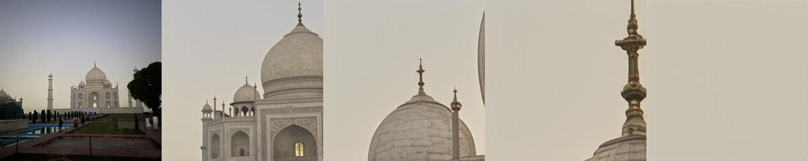
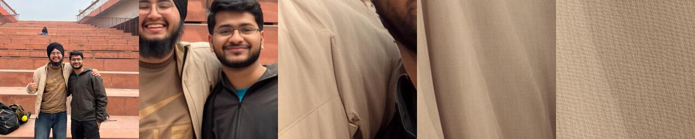
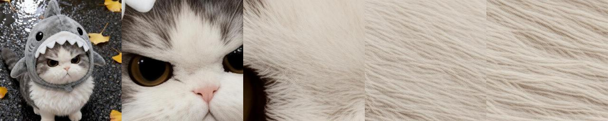
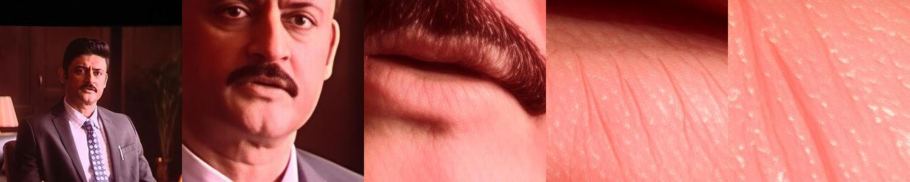

# ESRGAN for Wider Face Dataset

This project implements an ESRGAN (Enhanced Super-Resolution Generative Adversarial Network) based pipeline for the Wider Face dataset. The implementation can be used to train a model that upscales face images with high fidelity, preserving details important for facial recognition.

## Project Overview

The implementation follows a two-stage approach:
1. **Training Phase**: The model is trained using pairs of low-resolution (LR) and high-resolution (HR) images from the Wider Face dataset
2. **Upscaling Phase**: The trained model is used to upscale images to 4x their original resolution

## Results

The model enhances low-resolution images by reconstructing finer details and improving overall sharpness.

### Example 1


### Example 2


### Example 3


### Example 4


*Each image shows progressive enhancement from left (low-resolution input) to right (final ESRGAN output)*

## My Contributions
- Designed and implemented the low-resolution data generation pipeline for training
- Developed dataset loading pipeline for handling paired low- and high-resolution images  
- Contributed to integration and debugging of the ESRGAN training pipeline  

## Requirements

- Python 3.7+
- PyTorch 1.7+
- torchvision
- PIL (pillow)
- numpy
- tqdm
- OpenCV (cv2)

You can install the required packages using:

```bash
pip install torch torchvision pillow numpy tqdm opencv-python
```

## Dataset Preparation

1. Download the Wider Face dataset from: http://shuoyang1213.me/WIDERFACE/
2. Extract the dataset to your desired location
3. Update the `wider_face_path` in the `Config` class to point to your dataset directory

The dataset should have the following structure:
```
wider_face/
├── WIDER_train/
│   └── images/
│       ├── 0--Parade/
│       ├── 1--Handshaking/
│       └── ...
└── WIDER_val/
    └── images/
        ├── 0--Parade/
        ├── 1--Handshaking/
        └── ...
```

## Training the Model

To train the ESRGAN model:

```bash
python esrgan_implementation.py --mode train
```

The training process will:
1. Create low-resolution versions of the original images
2. Train the ESRGAN model using these pairs
3. Save the model checkpoints to the `output/models` directory
4. Generate sample outputs periodically in the `output/samples` directory

You can modify the training parameters in the `Config` class, such as:
- `batch_size`: Number of images per batch
- `lr`: Learning rate
- `num_epochs`: Total training epochs
- `hr_size`: Size of high-resolution patches for training
- `scale_factor`: Upscaling factor (default: 4)

## Upscaling Images

Once you have a trained model, you can use it to upscale any set of images:

```bash
python esrgan_implementation.py --mode upscale --model_path output/models/best_model.pth --input_dir input --output_dir upscaled
```

Parameters:
- `model_path`: Path to the trained model
- `input_dir`: Directory containing images to upscale
- `output_dir`: Directory where upscaled images will be saved

## Implementation Details

1. **Network Architecture**: The implementation uses the RRDB (Residual in Residual Dense Block) architecture from the original ESRGAN paper
2. **Loss Functions**: 
   - L1 loss for pixel-level reconstruction
   - Perceptual loss using VGG19 features for better perceptual quality
3. **Training Strategy**: The model is trained with a combination of these losses to balance between fidelity and perceptual quality

## Tips for Best Results

1. **Dataset Quality**: Ensure your Wider Face dataset has high-quality images for better training
2. **Training Time**: Allow sufficient training time - at least 100 epochs for good results
3. **Hardware**: Training on a GPU is highly recommended
4. **Parameter Tuning**: You may need to adjust the weights of different loss components for optimal results
5. **Batch Size**: Adjust the batch size according to your GPU memory
6. **Checkpointing**: The training will save models periodically; use the best model for final upscaling

## Additional Information

- The implementation will automatically handle images of different sizes
- The upscaling function preserves the relative paths of images from the input directory
- During training, sample outputs are generated to monitor progress
- The best model is selected based on PSNR (Peak Signal-to-Noise Ratio) on the validation set